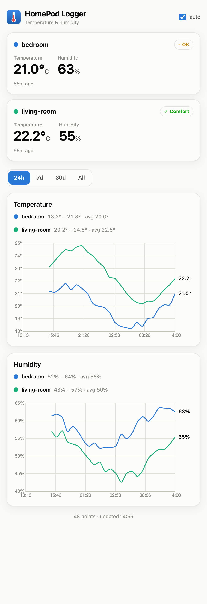
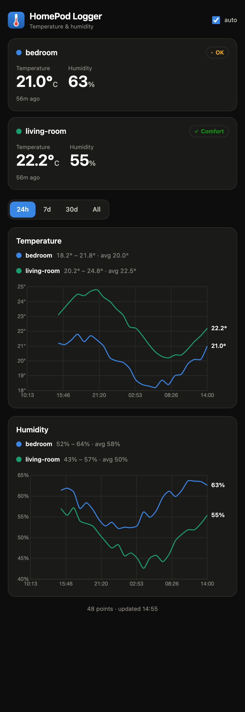

# HomePod Temp Logger

Continuously log **temperature** and **humidity** from your **HomePod (mini)**
speakers, store the history on your home server, and browse it from any browser —
Mac, iPhone, anything — as an installable web app (PWA).

The catch with HomePod sensors: **only Apple's ecosystem can read them**, and a
Shortcut can't loop on its own in the background. This project bridges that gap so
the logging runs **autonomously on the HomePod hub — no iPhone required** (not
awake, not present, no tapping). Everything stays **local (LAN)**; nothing is sent
to the internet.

<p align="center">
  
  &nbsp;
  
</p>

## Features

- 📈 **Dashboard** — temperature & humidity charts, both HomePods overlaid (or one
  apartment-average curve, your pick), with end-of-line value labels, hover
  crosshair + tooltip, and min / max / average per series.
- 🟢 **Live tiles** — current temperature & humidity per room, "x min ago", and a
  comfort chip (Comfort / OK / Out of range) that never relies on color alone.
- ⏱️ **Ranges** — 24h / 3d / 7d / 30d / all, with optional auto-refresh and a time
  axis pinned to round hours on the short ranges.
- 📊 **Today vs yesterday** — both days overlaid on a time-of-day axis for a quick
  differential read, plus a **daily-average history** (one color-binned figure per
  day) laid out as a monthly calendar you swipe through month by month.
- ☁️ **Optional outdoor weather** (Open-Meteo) as a recessive backdrop behind the
  indoor curves — off by default, the app stays 100% local unless you opt in.
- 🌗 **Light & dark**, responsive for phone and desktop, accessible (colorblind-safe
  palette).
- 📲 **Installable PWA** — add to your iPhone/Mac home screen; works offline from
  cache. Chart.js is vendored, so the page needs **no CDN**.
- 🗄️ **Tiny stack** — Python (FastAPI) + SQLite in one small container. No Postgres,
  no Redis, no cloud.
- 🔁 **Idempotent ingestion** — safe to replay; a `(homepod, timestamp)` pair is
  never duplicated.

## How it works

Apple only lets its own ecosystem read HomePod sensors, so reading goes through an
iOS **Shortcut**. A Shortcut can't loop in the background — but the **Home app**
can, on the HomePod hub. The bridge between the two is a **virtual switch** exposed
by Homebridge that the server flips once per hour:

```
[Unraid cron, hourly]
        │  toggle via Homebridge API
        ▼
[Virtual switch "HomePod Logger Trigger"] ──exposed to──▶ [Home app / HomePod hub]
        │
        │  Home automation: "switch turned on → run the Shortcut"
        ▼
[iOS Shortcut] reads temp + humidity of both HomePods
        │  local POST
        ▼
[Docker app on the server] stores in SQLite + serves the dashboard
```

- The **cadence** (once/hour) comes from the **server cron**, not from iOS.
- The **trigger** is a **Home app** automation (autonomous on the hub) — *not* a
  Shortcuts "time of day" automation (which runs on the iPhone and asks for
  confirmation).
- The iPhone is only used **once**, to create the Shortcut.

## Repository layout

| Folder | What | Stack |
|---|---|---|
| [`server/`](server/README.md) | Ingestion API + dashboard (live tiles, charts, PWA) | Python (FastAPI) + SQLite, Docker |
| [`homebridge-bridge/`](homebridge-bridge/README.md) | Virtual switch + hourly trigger script | homebridge-dummy + Python (stdlib) |
| [`ios-setup/`](ios-setup/README.md) | Step-by-step Apple setup (Shortcut + Home automation) | — (manual) |
| [`unraid/`](unraid/) | One-click Unraid "Add Container" template | XML |

## Quick start

**New here? Follow the full walkthrough:** [`TUTORIAL.md`](TUTORIAL.md) — from an
empty server to autonomous logging, with the exact Unraid fields.

Short version:

1. **Deploy the server** (Docker). On Unraid, use the prebuilt image:
   ```
   ghcr.io/gregbny/homepod-temp-logger:latest
   ```
   Map port `8088` and a volume to `/data`. See [`server/README.md`](server/README.md).
2. **Create the iOS Shortcut** that reads both HomePods and POSTs to
   `http://SERVER_IP:8088/api/readings`. See [`ios-setup/README.md`](ios-setup/README.md).
3. **Add the Homebridge virtual switch + hourly cron.** See
   [`homebridge-bridge/README.md`](homebridge-bridge/README.md).
4. **Wire the Home app automation** (switch → run Shortcut). Now it's autonomous.

## Payload contract (stable)

The Shortcut and the server stay decoupled through this fixed format. Any change
means versioning the endpoint.

```json
{ "readings": [
  { "homepod": "living-room", "temp": 24.3, "humidity": 52.0 },
  { "homepod": "bedroom",     "temp": 21.1, "humidity": 58.0 }
] }
```

`timestamp` is optional (ISO-8601 UTC); when absent the server uses receive time.
Ingestion is idempotent on `(homepod, timestamp)`.

## Privacy & scope

Local-only by design: the server makes no outbound requests, and all URLs are
`http://LAN_IP:PORT`. Nothing is exposed to the internet. You own the data (a single
SQLite file in your appdata volume).

## License

[MIT](LICENSE).
